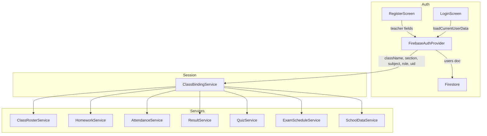

# Design Document — Class-Based Assignment

## Overview

This feature ties each teacher to a specific class (`className` + `section` + `subject`) at registration time, then uses that binding to automatically scope all data operations — homework, attendance, results, quizzes, exam schedules, and notices — to the teacher's class. Students see only their own class's data. The Principal retains unrestricted cross-class visibility.

The change is additive: existing Firestore collections keep their current shape; new fields (`className`, `section`, `subject`) are already present in most models. The main work is:
1. Enforcing ClassBinding at registration for teachers
2. Introducing `ClassRosterService` to load students by class
3. Adding a `ClassBindingService` (session singleton) so all services can read the current user's class context
4. Updating `SchoolDataService` / `NoticePostModel` for scoped notice publishing
5. Tightening Firestore security rules

---

## Architecture



Data flow after login:

```
LoginScreen
  → FirebaseAuthProvider.loadCurrentUserData()
  → ClassBindingService.init(userData)   ← new
  → navigate to role dashboard
```

All services call `ClassBindingService.binding` to get `className`, `section`, `subject`, and `role` for filtering and document creation.

---

## Components and Interfaces

### New: `ClassBindingService`

**File:** `lib/core/services/class_binding_service.dart`

A lightweight `GetxService` that holds the authenticated user's class context for the session. Initialized once after login/signup.

```dart
class ClassBindingService extends GetxService {
  final Rx<ClassBinding?> _binding = Rx<ClassBinding?>(null);

  ClassBinding? get binding => _binding.value;
  bool get hasBinding => _binding.value != null;

  void init(Map<String, dynamic> userData) { ... }
  void clear() { _binding.value = null; }
}

class ClassBinding {
  final String uid;
  final String role;        // 'student' | 'teacher' | 'principal'
  final String? className;
  final String? section;
  final String? subject;    // teacher only
  final String name;
  final String email;
}
```

Registered in `main.dart` as a permanent service. `LoginScreen` and `RegisterScreen` call `ClassBindingService.init()` after successful auth.

---

### New: `ClassRosterService`

**File:** `lib/features/class/services/class_roster_service.dart`

Queries the `users` collection for students matching a given `className` + `section`.

```dart
class ClassRosterService extends GetxService {
  final RxList<StudentUserModel> roster = <StudentUserModel>[].obs;
  final RxBool isLoading = false.obs;

  Future<void> loadRoster({required String className, required String section}) async { ... }
  Future<List<StudentUserModel>> loadAllStudents() async { ... }  // principal
}

class StudentUserModel {
  final String uid;
  final String name;
  final String email;
  final String rollNumber;
  final String className;
  final String section;
}
```

---

### Modified: `RegisterScreen`

**File:** `lib/features/auth/views/register_screen.dart`

Add teacher-specific fields alongside the existing student fields block:

- Class selector dropdown (values: '1'–'10')
- Section selector dropdown (values: A, B, C)
- Subject text field

Validation: all three fields required for teacher role. On submit, pass `className`, `section`, `subject` to `FirebaseAuthProvider.signUp()`.

Uniqueness check: before calling `signUp`, query `users` collection for `role == 'teacher' AND className == X AND section == Y`. If a document exists, show snackbar "This class already has an assigned teacher."

---

### Modified: `FirebaseAuthProvider`

**File:** `lib/features/auth/providers/firebase_auth_provider.dart`

- Add `subject` parameter to `signUp()` and store it in the users document.
- After successful `signIn` + `loadCurrentUserData`, call `ClassBindingService.init(userData)`.

---

### Modified: `LoginScreen`

**File:** `lib/features/auth/views/login_screen.dart`

After `loadCurrentUserData()`, call `Get.find<ClassBindingService>().init(userData)`.

---

### Modified: `HomeworkService`

**File:** `lib/features/homework/services/homework_service.dart`

Add filtered load methods:

```dart
Future<void> loadForClass({required String className, required String section}) async { ... }
// loadAll() already exists — used by principal
```

`addAssignment()` and `addSolution()` already accept `className`/`section` — callers pass values from `ClassBindingService`.

---

### Modified: `AttendanceService`

**File:** `lib/features/attendance/services/attendance_service.dart`

Add:

```dart
Future<void> submitBulkAttendance({
  required List<StudentUserModel> roster,
  required Map<String, AttendanceStatus> statusMap,  // uid -> status
  required String date,  // 'yyyy-MM-dd'
}) async { ... }

Future<List<AttendanceEntryModel>> loadForClass({
  required String className,
  required String section,
}) async { ... }

Future<List<AttendanceEntryModel>> loadForStudent(String email) async { ... }
```

Document ID convention: `'${studentUid}_${date}'` — enables upsert via `setCollectionDocument(..., merge: true)`.

---

### Modified: `ResultService`

No signature changes — `upsertResult()` already exists. Document ID convention: `'${studentUid}_${term}_${examType}'`.

---

### Modified: `QuizService` and `ExamScheduleService`

Both already have `quizzesForClass()` / `schedulesForClass()`. Add:

```dart
Future<void> loadForClass({required String className, required String section}) async { ... }
Future<void> loadAll() async { ... }  // principal
```

---

### Modified: `SchoolDataService`

**File:** `lib/features/school/services/school_data_service.dart`

`publishNotice()` gains `scope`, `className`, `section` parameters:

```dart
Future<void> publishNotice({
  required String title,
  required String body,
  required String authorName,
  required String authorRole,
  required String category,
  required String scope,        // 'school' | 'class'
  String? className,
  String? section,
}) async { ... }

List<NoticePostModel> noticesForUser({
  required String role,
  String? className,
  String? section,
}) { ... }
```

---

## Data Models

### `ClassBinding` (new — in-memory only)

```dart
class ClassBinding {
  final String uid;
  final String role;
  final String? className;
  final String? section;
  final String? subject;    // teacher only
  final String name;
  final String email;
}
```

Source of truth is the `users` Firestore document; this is a session-scoped cache.

---

### `users` collection — teacher document (updated)

| Field | Type | Notes |
|---|---|---|
| `uid` | String | existing |
| `email` | String | existing |
| `name` | String | existing |
| `role` | String | existing |
| `phone` | String | existing |
| `className` | String | existing for students; **now required for teachers** |
| `section` | String | existing for students; **now required for teachers** |
| `subject` | String | **new** — teacher only |
| `createdAt` | String | existing |
| `updatedAt` | String | existing |

---

### `NoticePostModel` (updated)

Add three fields to the existing model:

```dart
final String scope;        // 'school' | 'class'  — default 'school' for backward compat
final String? className;   // null when scope == 'school'
final String? section;     // null when scope == 'school'
```

`toMap()` / `fromMap()` updated. Existing documents without `scope` default to `'school'`.

---

### `attendance_entries` — updated

New document ID format: `'${studentUid}_${dateString}'` (e.g. `'abc123_2025-01-15'`).

New fields added to `AttendanceEntryModel`:

| Field | Type | Notes |
|---|---|---|
| `studentId` | String | uid of student, for Firestore rule matching |
| `date` | String | `'yyyy-MM-dd'` for querying |

---

### `results` — updated document ID

Document ID: `'${studentUid}_${term}_${examType}'` — enables upsert. Existing `ResultModel` fields unchanged.

---

### `StudentUserModel` (new)

```dart
class StudentUserModel {
  final String uid;
  final String name;
  final String email;
  final String rollNumber;
  final String className;
  final String section;
}
```

Mapped from `users` collection documents where `role == 'student'`.

---


## Correctness Properties

*A property is a characteristic or behavior that should hold true across all valid executions of a system — essentially, a formal statement about what the system should do. Properties serve as the bridge between human-readable specifications and machine-verifiable correctness guarantees.*

### Property 1: Teacher registration field validation rejects whitespace

*For any* registration form submission where `className`, `section`, or `subject` is a string composed entirely of whitespace characters, the validator SHALL reject the submission and the `users` collection SHALL remain unchanged.

**Validates: Requirements 1.2**

---

### Property 2: Teacher registration stores ClassBinding fields

*For any* valid teacher registration with non-empty `className`, `section`, and `subject`, after successful registration the `users` document for that teacher SHALL contain `className`, `section`, and `subject` values equal to the submitted values.

**Validates: Requirements 1.3**

---

### Property 3: One teacher per class+section uniqueness

*For any* `className` + `section` combination that already has a registered teacher, a second teacher registration attempt with the same `className` + `section` SHALL be rejected, and the `users` collection SHALL still contain exactly one teacher document for that combination.

**Validates: Requirements 1.4**

---

### Property 4: Session ClassBinding matches users document

*For any* teacher login, the `ClassBindingService.binding` values for `className`, `section`, and `subject` SHALL equal the corresponding fields in the teacher's `users` Firestore document.

**Validates: Requirements 1.5**

---

### Property 5: ClassRoster filter correctness

*For any* teacher ClassBinding, every `StudentUserModel` returned by `ClassRosterService.loadRoster()` SHALL have `className == binding.className` AND `section == binding.section` AND `role == 'student'`.

**Validates: Requirements 2.1, 2.4**

---

### Property 6: ClassFilter applied to all student-facing collections

*For any* student user with a valid `className` and `section`, every document returned by `HomeworkService.loadForClass()`, `QuizService.loadForClass()`, `ExamScheduleService.loadForClass()`, and the solutions load path SHALL have `className == student.className` AND `section == student.section`.

**Validates: Requirements 3.3, 6.2, 7.2, 11.2**

---

### Property 7: Homework document contains ClassBinding fields

*For any* homework assignment created by a teacher, the stored `homework_assignments` document SHALL contain `className`, `section`, `subject`, and `teacherName` values equal to the teacher's ClassBinding.

**Validates: Requirements 3.2**

---

### Property 8: Attendance bulk submit creates one document per student

*For any* ClassRoster of N students, after `submitBulkAttendance()` completes, the `attendance_entries` collection SHALL contain exactly N documents for that `date`, one per student in the roster, each containing `studentName`, `rollNumber`, `className`, `section`, `email`, `date`, and `status`.

**Validates: Requirements 4.2**

---

### Property 9: Attendance upsert idempotence

*For any* student and date, submitting attendance twice SHALL result in exactly one `attendance_entries` document for that `studentId` + `date` combination, with the `status` reflecting the most recent submission.

**Validates: Requirements 4.3**

---

### Property 10: Result upsert round-trip

*For any* student in the ClassRoster, after `upsertResult()` is called with a given `term` and `examType`, querying results by `studentId` SHALL return a document whose `score`, `maxScore`, `term`, and `examType` match the submitted values.

**Validates: Requirements 5.2, 5.3**

---

### Property 11: Principal sees all data without ClassFilter

*For any* collection (homework_assignments, attendance_entries, results, quizzes, exam_schedules, school_data notices), when loaded via the principal code path, the returned list SHALL contain documents from all classes and sections without any `className`/`section` filter applied.

**Validates: Requirements 2.5, 3.5, 4.5, 5.4, 6.3, 7.3, 9.1, 11.4, 12.7**

---

### Property 12: Dashboard counts are consistent with roster and attendance data

*For any* teacher ClassBinding and current date, the `presentCount` and `absentCount` displayed on TeacherDashboard SHALL satisfy: `presentCount + absentCount == number of attendance_entries for that className+section+date`, and `presentCount == count of entries with status == present`.

**Validates: Requirements 8.2, 8.3**

---

### Property 13: Dashboard recent homework ordering

*For any* homework list for a teacher's class, the three items displayed on TeacherDashboard SHALL be the three items with the largest `createdAt` values in the list.

**Validates: Requirements 8.4**

---

### Property 14: Teacher cannot write outside their ClassBinding

*For any* teacher, any attempt to create or update a document in `homework_assignments`, `attendance_entries`, `results`, `quizzes`, `exam_schedules`, or `homework_solutions` where the document's `className` or `section` does not match the teacher's ClassBinding SHALL be rejected by client-side validation or Firestore rules.

**Validates: Requirements 10.2, 11.3**

---

### Property 15: Student cannot read documents from other classes

*For any* student, any Firestore read of a `homework_assignments`, `quizzes`, or `exam_schedules` document where the document's `className` or `section` does not match the student's own SHALL be denied with a permission-denied error.

**Validates: Requirements 10.1, 10.4**

---

### Property 16: Notice scope filter correctness

*For any* non-principal user (student or teacher) with a valid `className` and `section`, every notice returned by `SchoolDataService.noticesForUser()` SHALL satisfy: `scope == 'school'` OR (`scope == 'class'` AND `className == user.className` AND `section == user.section`).

**Validates: Requirements 12.3, 12.4**

---

### Property 17: Teacher cannot publish school-scoped notice

*For any* teacher, calling `publishNotice()` with `scope == 'school'` SHALL be rejected, and no document with `scope == 'school'` authored by a teacher SHALL appear in the `school_data` store.

**Validates: Requirements 12.5**

---

### Property 18: Notice scope stored correctly

*For any* principal publishing a notice, the stored `NoticePostModel` SHALL have `scope == 'school'`. *For any* teacher publishing a notice, the stored `NoticePostModel` SHALL have `scope == 'class'`, `className == teacher.className`, and `section == teacher.section`.

**Validates: Requirements 12.1, 12.2**

---

## Error Handling

| Scenario | Handling |
|---|---|
| Teacher registers for already-claimed class+section | Client-side pre-check query; show snackbar "This class already has an assigned teacher." |
| Student's `className`/`section` missing from users doc | `ClassBindingService.binding` returns null fields; UI shows "Class information not found. Please contact your teacher." |
| ClassRoster returns empty list | `ClassRosterService.roster` is empty; TeacherDashboard shows "No students enrolled in your class yet." |
| No attendance for today | `AttendanceService` returns empty list for today's date; TeacherDashboard shows "Attendance not marked yet for today." |
| Firestore permission denied | `FirestoreCollectionService._guard` catches `FirebaseException` and throws `AppException`; UI surfaces the message |
| Bulk attendance partial failure | Use `Future.wait` with error collection; report partial failure count to teacher |
| `ClassBindingService` not initialized | Guard all service calls with `hasBinding` check; redirect to login if binding is null |

---

## Testing Strategy

### Unit Tests

Focus on specific examples and edge cases:

- `ClassBindingService.init()` with teacher userData sets all fields correctly
- `ClassBindingService.init()` with student userData sets className/section but not subject
- `ClassRosterService.loadRoster()` with empty result shows correct empty state
- `NoticePostModel.fromMap()` with missing `scope` field defaults to `'school'` (backward compatibility)
- Attendance document ID generation: `'${uid}_${date}'` format
- Result document ID generation: `'${uid}_${term}_${examType}'` format
- Teacher registration uniqueness check query construction
- `SchoolDataService.noticesForUser()` with principal role returns all notices
- TeacherDashboard shows "Attendance not marked yet for today." when no entries exist for today

### Property-Based Tests

Use `glados` package for Dart property-based testing. Each test runs minimum 100 iterations.

Tag format: `// Feature: class-based-assignment, Property N: <property_text>`

```dart
// Feature: class-based-assignment, Property 1: Teacher registration field validation rejects whitespace
// Generate: random whitespace-only strings for className, section, subject
// Assert: validator returns error, no Firestore write occurs

// Feature: class-based-assignment, Property 2: Teacher registration stores ClassBinding fields
// Generate: random valid className (1-10), section (A-C), subject strings
// Assert: users doc contains exact submitted values after registration

// Feature: class-based-assignment, Property 3: One teacher per class+section uniqueness
// Generate: random className+section pairs, attempt two registrations
// Assert: second registration rejected, collection has exactly one teacher for that pair

// Feature: class-based-assignment, Property 5: ClassRoster filter correctness
// Generate: random users collection with mixed classes/sections/roles
// Assert: loadRoster() returns only students matching the given className+section

// Feature: class-based-assignment, Property 6: ClassFilter applied to all student-facing collections
// Generate: random homework/quiz/exam collections with mixed className+section values
// Assert: loadForClass() returns only items matching the student's class

// Feature: class-based-assignment, Property 8: Attendance bulk submit creates one document per student
// Generate: random roster of N students (1-50), random status map
// Assert: after submitBulkAttendance, exactly N documents exist for that date

// Feature: class-based-assignment, Property 9: Attendance upsert idempotence
// Generate: random student+date, two different status values
// Assert: two submissions result in exactly one document with the latest status

// Feature: class-based-assignment, Property 11: Principal sees all data without ClassFilter
// Generate: random collections with documents from multiple classes
// Assert: principal load path returns all documents regardless of className/section

// Feature: class-based-assignment, Property 16: Notice scope filter correctness
// Generate: random notice collections with mixed scope/className/section values
// Assert: noticesForUser() returns only school-scoped or matching class-scoped notices

// Feature: class-based-assignment, Property 18: Notice scope stored correctly
// Generate: random notice content, random teacher ClassBinding
// Assert: stored document has scope=='class' and matching className/section
```

### Integration Tests

- Full registration → login → ClassBinding session flow for teacher role
- Teacher creates homework → student loads homework → only matching class items returned
- Teacher submits bulk attendance → student views attendance → only own entries returned
- Principal views homework → all classes returned without filter
- Notice publish by principal → all users see it; notice publish by teacher → only matching class sees it

---

## Firestore Rules Changes

New helper functions added to the existing rules:

```javascript
function userDoc() {
  return get(/databases/$(database)/documents/users/$(request.auth.uid)).data;
}

function matchesUserClass(docData) {
  return docData.className == userDoc().className
      && docData.section == userDoc().section;
}
```

Updated collection rules (replace existing blocks):

```javascript
// homework_assignments
match /homework_assignments/{assignmentId} {
  allow read: if isPrincipal()
              || isTeacher()
              || (isStudent() && matchesUserClass(resource.data));
  allow create: if isPrincipal()
                || (isTeacher() && matchesUserClass(request.resource.data));
  allow update: if isPrincipal()
                || (isTeacher() && matchesUserClass(resource.data));
  allow delete: if isPrincipal();
}

// quizzes
match /quizzes/{quizId} {
  allow read: if isPrincipal()
              || isTeacher()
              || (isStudent() && matchesUserClass(resource.data));
  allow create: if isPrincipal()
                || (isTeacher() && matchesUserClass(request.resource.data));
  allow update: if isPrincipal()
                || (isTeacher() && matchesUserClass(resource.data));
  allow delete: if isPrincipal();
}

// exam_schedules
match /exam_schedules/{scheduleId} {
  allow read: if isPrincipal()
              || isTeacher()
              || (isStudent() && matchesUserClass(resource.data));
  allow create: if isPrincipal()
                || (isTeacher() && matchesUserClass(request.resource.data));
  allow update: if isPrincipal()
                || (isTeacher() && matchesUserClass(resource.data));
  allow delete: if isPrincipal();
}

// attendance_entries
match /attendance_entries/{entryId} {
  allow read: if isPrincipal()
              || (isTeacher() && matchesUserClass(resource.data))
              || (isStudent() && resource.data.email == request.auth.token.email);
  allow create: if isPrincipal()
                || (isTeacher() && matchesUserClass(request.resource.data));
  allow update: if isPrincipal()
                || (isTeacher() && matchesUserClass(resource.data));
  allow delete: if isPrincipal();
}

// results
match /results/{resultId} {
  allow read: if isPrincipal()
              || (isTeacher() && matchesUserClass(resource.data))
              || (isStudent() && resource.data.studentId == request.auth.uid);
  allow create: if isPrincipal()
                || (isTeacher() && matchesUserClass(request.resource.data));
  allow update: if isPrincipal()
                || (isTeacher() && matchesUserClass(resource.data));
  allow delete: if isPrincipal();
}

// school_data — teacher can write; scope enforcement is client-side in SchoolDataService
match /school_data/{docId} {
  allow read: if signedIn();
  allow write: if isPrincipal() || isTeacher();
}
```

**Note on `school_data` scope enforcement:** Firestore rules cannot inspect nested array fields (the `noticePosts` array inside `school_data/main`). The `scope == 'school'` restriction for teachers is enforced in `SchoolDataService.publishNotice()` — it throws an exception if a teacher passes `scope: 'school'`. The Firestore rule permits teacher writes to `school_data` but the service layer is the primary guard.
